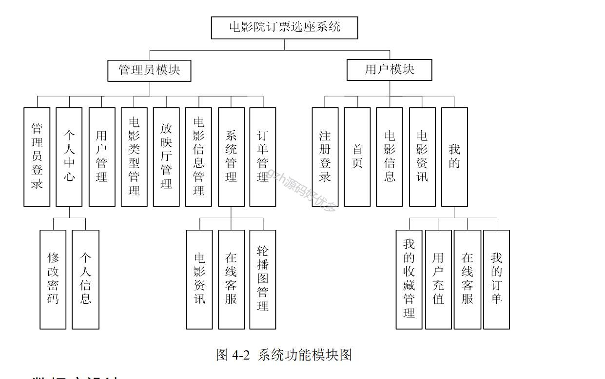
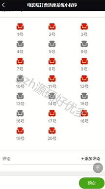
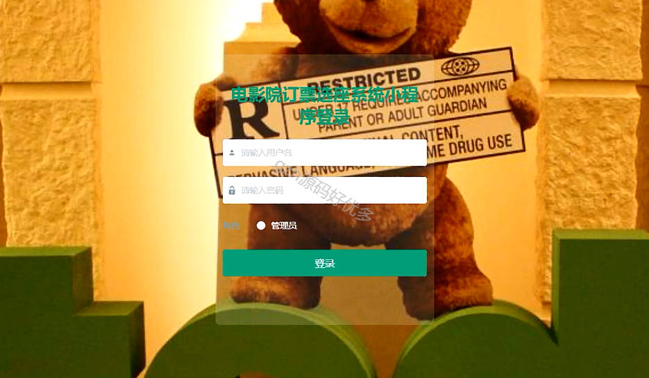
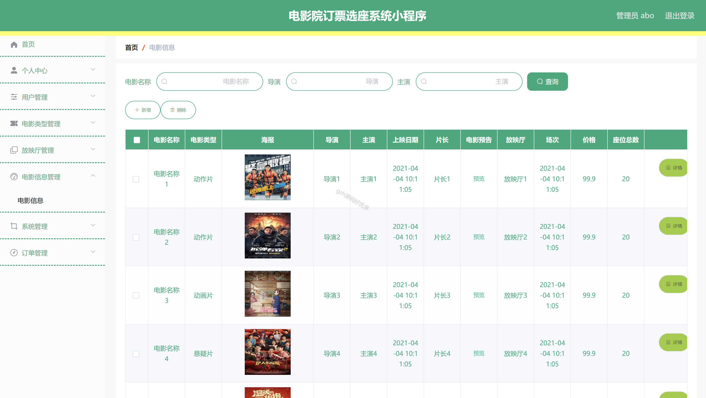
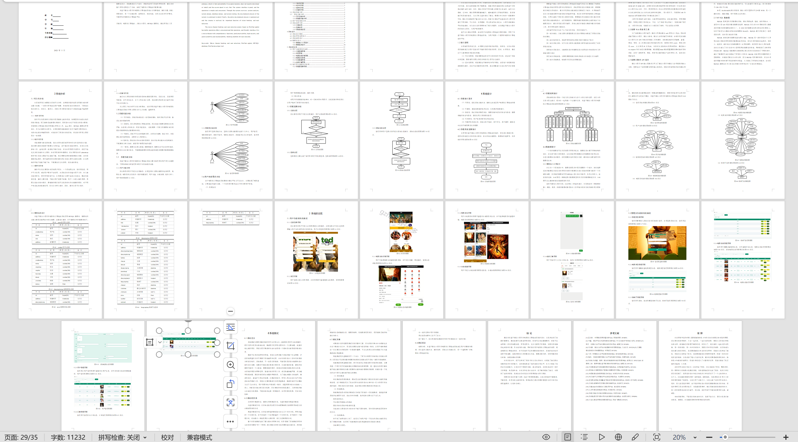

# mpweixinA061
mpweixinA061电影院订票选座微信小程序LW+PPT
 
## 查看主页获取源码

### 一、作品包含

源码+数据库+设计文档万字+PPT+全套环境和工具资源+部署教程

### 二、项目技术

前端技术：Html、Css、Js、Vue、Element-ui、Uniapp

数据库：MySQL

后端技术：Java、Spring Boot、MyBatis

  

### 三、运行环境

开发工具：IDEA/eclipse + HBuilderX + 微信开发者工具

数据库：MySQL5.7

数据库管理工具：Navicat10以上版本

环境配置软件： JDK1.8+Maven3.6.3

前端Nodejs：14

### 四、项目介绍
项目编号：mpweixinA061

随着计算机技术的成熟，互联网的建立，如今，PC平台上有许多关于电影院订票选座方面的应用程序，但由于使用时间和地点上的限制，用户在使用上存在着种种不便，而开发一款基于微信小程序的电影院订票选座系统，能够有效地解决这个问题。

管理员模块
管理员登录、个人中心、用户管理、电影类型管理、放映厅管理、电影信息管理、系统管理和订单管理。个人中心包括修改密码、个人信息。系统管理包括电影资讯、在线客服和轮播图管理。用户模块有注册登录、首页、电影信息、电影资讯、我的。我的里面有我的收藏管理、用户充值、在线客服和我的订单。管理员模块、用户模块。管理员模块有管理员登录、个人中心、用户管理、电影类型管理、放映厅管理、电影信息管理、系统管理和订单管理。个人中心包括修改密码、个人信息。系统管理包括电影资讯、在线客服和轮播图管理。
用户模块
注册登录、首页、电影信息、电影资讯、我的。我的里面有我的收藏管理、用户充值、在线客服和我的订单。

### 五、运行截图

  
